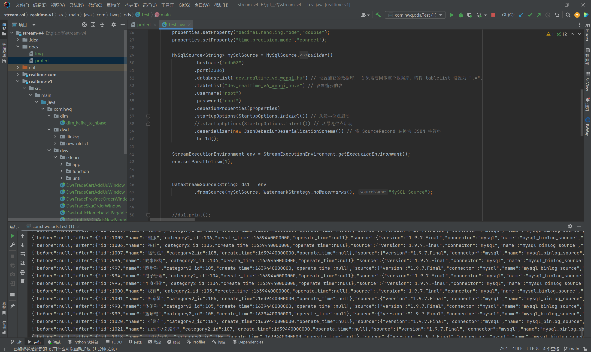
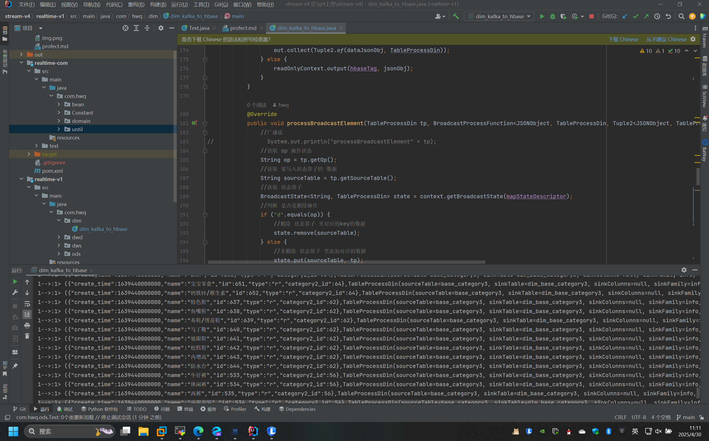
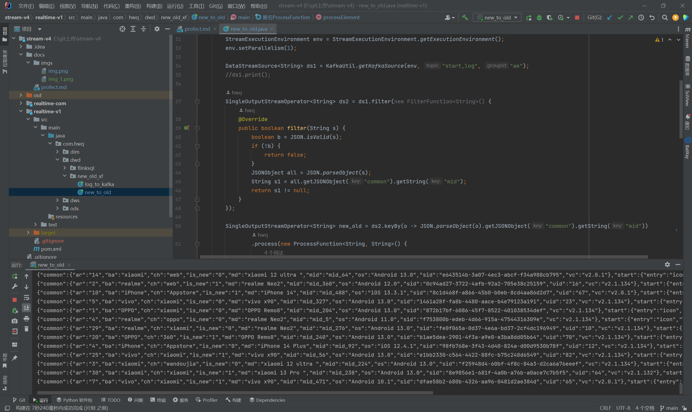
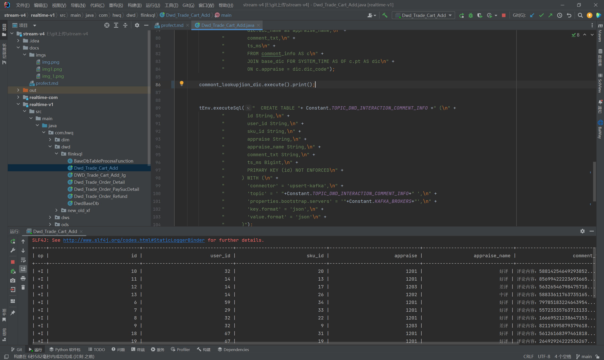
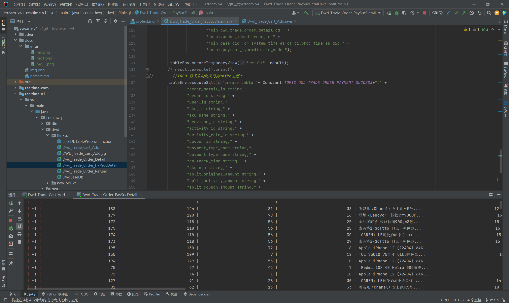
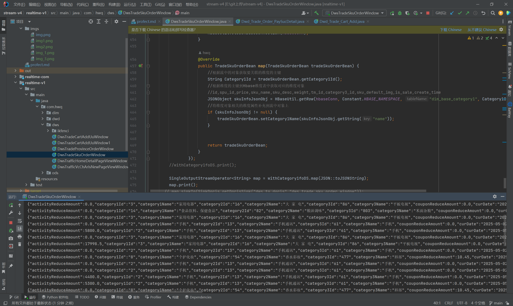
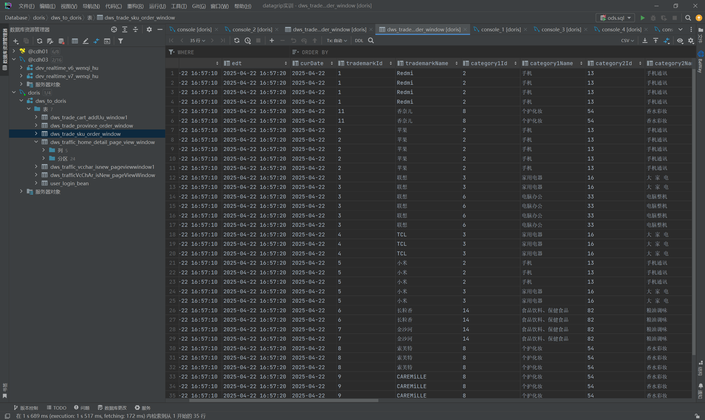
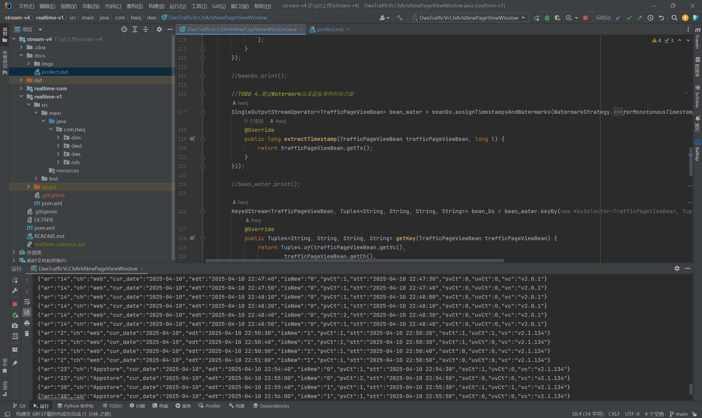
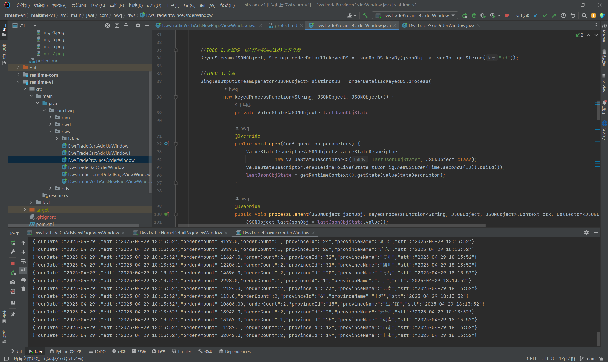
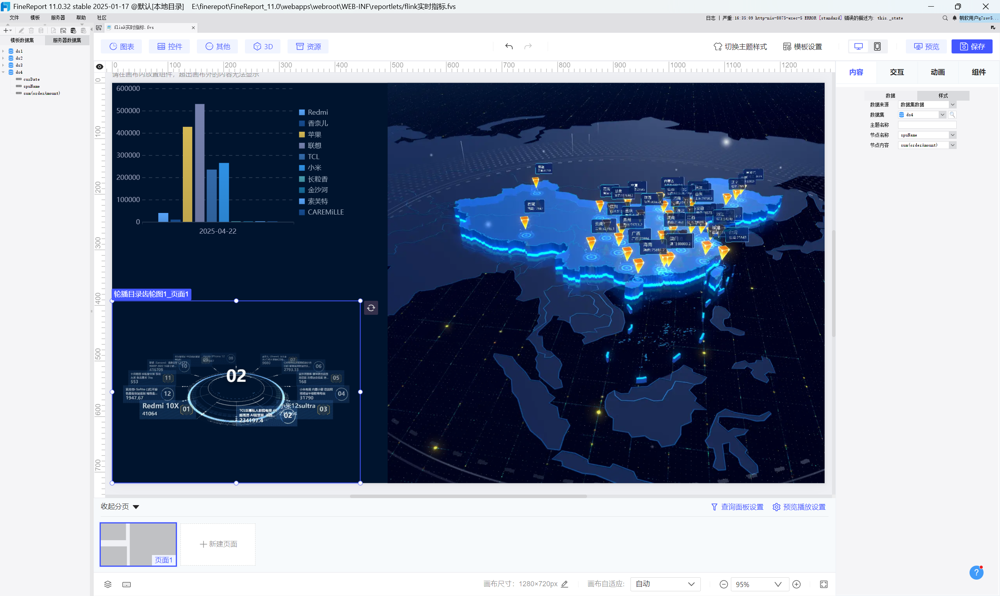

数据来源:业务数据
        日志数据:曝光日志,动作日志,页面日志,启动日志,错误日志
技术栈:
     数据采集:flinkcdc,flume
     数据存储:hbase,hive,doris,kafka
flink概念:高性能,弹性,高可用,高并发,高吞吐。
和flinkcdc相似的采集软件有:maxwell：mysql数据库的binlog数据，将binlog数据转换成json数据，并写入kafka。

状态去重:用到了取反过滤,将数据去重,避免重复消费。因为flinkcdc是增量采集,所以不能保证数据不重复。

doris物化图概念:。Doris 物化视图是一种将查询结果预先存储起来的特殊表，它既包含计算逻辑也包含数据。其核心作用是通过预计算和存储数据，来加速查询并节省计算资源
使用场景：
决策支持系统：在 BI 报表、Ad - Hoc 查询等场景中，可对常见的包含聚合操作、可能涉及多表连接的分析型查询进行加速。
数据分层场景：通过嵌套物化视图来构建 DWD（数据仓库明细层）和 DWM（数据仓库中间层）层，利用其调度刷新能力。
核心价值
查询加速：能将原本可能需要分钟级的复杂查询优化至秒级响应，极大地提升了查询效率。
资源节省：减少了大量重复计算所消耗的资源，可节省约 80% 的计算资源。
架构简化：可替代传统的 ETL 流程来构建实时数仓，简化了数据处理架构。
         
1.ods层,用flinkcdc采取mysql业务数据数据,判断数据是否是json格式并且判断after是否为空,然后存储到kafka,效果如下:

2.dim层从kafka读取业务层原始数据,然后用flinkcdc采集mysql的维度数据,
然后用广播连接,将维度数据广播给业务数据,然后进行join,将维度数据与业务数据进行join,将结果写入到hbase,效果如下:

3.新老用户,从kafka获取页面日志信息,然后使用工具类读取kafka,将日志信息分流分别存入到kafka,提取启动日志信息做新老用户,
//判断 is_new 是否为 "1"。
//如果 s1 为 "1"，将状态更新为今天的日期。
//如果 s1 不是今天的日期，将 is_new 字段更新为 "0"，表示不是新用户。
//如果状态为空，将状态更新为昨天的日期。,写入到kafuka：

4.flinksql:ods层原始数据连接维度hbase相关的数据写入到kafka

5.dws读取kafka数据连接hbase数据写入到doris
(1)sku粒度下单业务过程聚合统计

(2)按照版本、地区、渠道、新老访客对pv、uv、sv、dur进行聚合统计：

(3)统计各省份订单金额

6.报表,统计各省份下单金额:按照省份分区,统计出各省份订单金额。
各品牌订单金额:按照品牌分区,统计出各品牌订单金额。
各商品下单总金额:按照商品名称分区,统计出各商品下单总金额。
个省份下单次数:按照省份分区,统计出各省份下单数量。
搜索词频:按照搜索词分区,统计出搜索词出现的次数。

